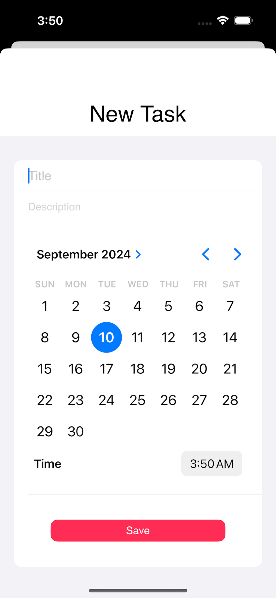
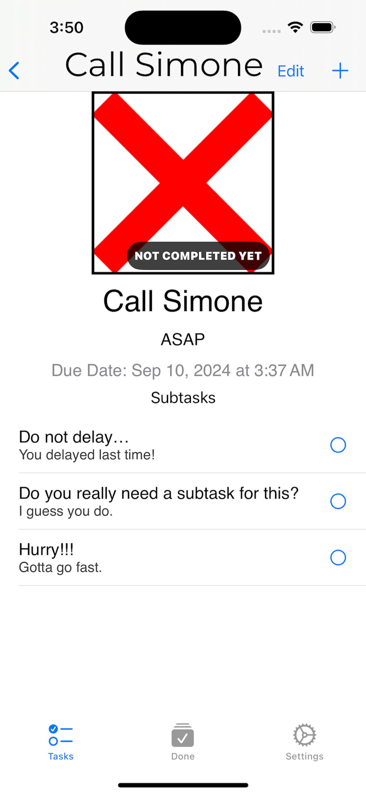
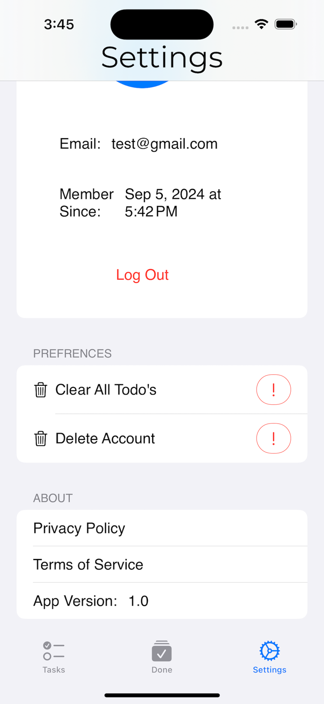

# Welcome to Auto Do It!

Auto Do It is a productivity app I built to manage tasks with a clean, intuitive interface. The name is a play on words: *you ought to do it* — and *automatically* doing it using AI. Create tasks with subtasks, track what's done, and use AI to generate entire to-do lists from a topic. Everything syncs in real time across your devices.

## Table of Contents
- [Screenshots](#screenshots)
- [Description](#description)
- [Architecture](#architecture)
- [How To Use](#how-to-use)
- [Acknowledgements](#acknowledgements)

## Screenshots







## Description

- **100% SwiftUI**
- **MVVM architecture** with feature based organization (ToDoList, Done, AI, Settings)
- **Tasks with subtasks** — nest subtasks under main items, edit and complete independently
- **Firebase backend** (Auth, Firestore) — your tasks sync across devices
- **AI powered list generation** — enter a topic and optional requirements, get a structured to-do list with tasks and subtasks via OpenAI
- **Done view** — separate tab for completed tasks
- **Custom typography** — Montserrat and Playfair Display
- **Settings** — profile, privacy policy, terms of service
- **Light and dark mode support**

### Frameworks
- SwiftUI
- Firebase (Auth, Firestore, FirestoreSwift)
- OpenAI API (GPT) for list generation

### Swift Package Manager
Firebase is added via Swift Package Manager.

## What I Learned

Auto Do It started as a way to learn SwiftUI and Firebase while building something I would actually use. I wanted a to-do app that felt simple but could handle real projects — tasks with subtasks, sections, and due dates. The AI feature is what gave the app its name: I wanted to reduce the friction of starting a new list. Instead of staring at a blank screen, you describe what you're planning (e.g., "trip to Japan" or "launch a side project") and get a structured list you can tweak and save — automatically.

The biggest challenge was the AI integration. Getting OpenAI to return a consistent, parseable format (tasks and subtasks with a specific delimiter structure) took a lot of prompt iteration. The parsing logic in AIView — splitting on `###` and `>>>` — had to be robust enough to handle variations in the model's output.

I also learned a lot about Firestore's real time listeners and the `@FirestoreQuery` property wrapper. Keeping tasks, subtasks, and sections in sync across nested collections required careful data modeling.

## Accomplishments

- AI driven list generation based on topic and optional requirements
- Full task and subtask hierarchy with real time sync
- Done view with seamless move between active and completed
- Firebase Auth and Firestore integration
- Built independently

## Architecture

The project is organized by feature:

- **Content/** — Main tab container, auth check
- **ToDoList/** — Task list, item views, add/edit flows, subtasks
- **Done/** — Completed tasks view
- **AI/** — Generate tab: topic input, OpenAI prompts, response parsing, add to Firestore
- **BeforeLogin/** — Login, Register
- **Settings/** — Profile, privacy policy, terms of service
- **Models/** — ToDoListItem, SubTask, User
- **ViewModels/** — One per major view (ToDoListView, AIView, etc.)
- **Other/** — App entry, extensions, assets, launch screen

## How To Use

1. **Clone the repo**
   ```
   git clone https://github.com/ConnorJamesHill/ToDoList.git
   ```

2. **Open** `ToDoList.xcodeproj` in Xcode

3. **Add required config files** (see `.gitignore`):
   - `GoogleService-Info.plist` — from your Firebase project
   - Copy `ToDoList/Views/AI/Secrets.swift.example` to `Secrets.swift` and add your OpenAI API key

4. **Build and run** on a device or simulator

**Available on the App Store**

## Acknowledgements

- [Firebase](https://firebase.google.com/)
- [OpenAI](https://openai.com/)
- [Montserrat](https://fonts.google.com/specimen/Montserrat) and [Playfair Display](https://fonts.google.com/specimen/Playfair+Display) (Google Fonts)
